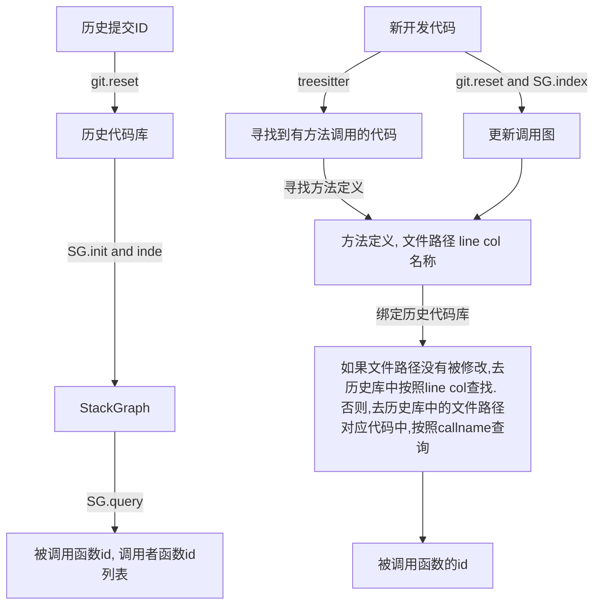

## Test dataset builder
The selected repos must satisfy the following requirements:
    1. ignore repos with less than 50 methods.
    2. file nums <= 1000. (For BM25 search)
    3. commit代码文件个数 > 10

The added methods should not be same before the same repo, (refactor)

The called func must satisfy the following requirements:
    1. does not occur before in current file.
    2. has either cross-file definition or history callee in the repository. (This makes search action meaningful.)
    3. There are no two same ground truths in the same repository.
    4. only contains one call in the target line (To avoid complex retrieval conditions.)

## Test Sample Format
```json
{   
    "prompt": "the left code context",
    "groundtruth": "the target completed code",
     
    "call_meta": {
        "signature": "func_name:param_list",
        
        "called_def": {
            "stmt": "the definition stmt", 
            "file_path": " the location of the def",
            "type": "method/class",
                # To evaluate the acc of different retrieval methods,
                # for class def, its range is [-1, -1], which means the whole code file.
                # for method def, its range is [start_pos, end_pos]
            "range": [[line_no, col_no], [line_no, col_no]]
         },
         
        "history_callees": [
            {"file_path": "the location of history callee",
             "callee_stmt": "the stmt of callee",
             "range": [[line_no, col_no], [line_no, col_no]]}
        ],
    },
    
    "file_meta": {
        "file_path": "",
        "commit_id": "",
        "lifecycle": "Initiation/Intermediate/Closure",
        "delete_import_lines": [(line_no, import_stmt)],
        "right_context": "",
    }
}
```

